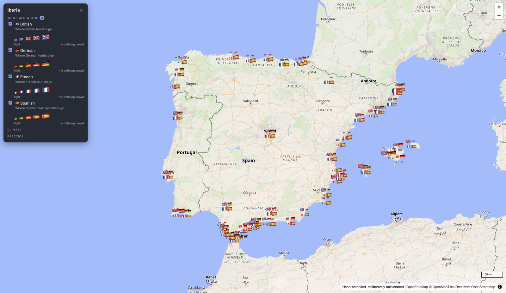

# Iberia

A map of Spain, one data layer at a time.



## Why

I moved to Spain and wanted to understand it better than a guidebook allows — where it
rains, where everyone else goes, and where they don't. Each layer answers one question,
and switching two on at once usually asks a better one.

It doubles as a way of deciding where to go over the coming year. The nationality layers
started as a joke about avoiding the Costa del Sol and turned into the most useful thing
here: switch all four on and the country divides itself up in front of you.

## Layers

| Layer | What it shows | Source |
| --- | --- | --- |
| Yearly rainfall | Mean annual precipitation, 2015–2024 | Open-Meteo Best Match historical weather, 0.5° grid |
| Rainy days | Mean days/year with at least 1 mm, 2015–2024 | Same Open-Meteo rainfall grid |
| Very heavy rain | Mean days/year with at least 20 mm, 2015–2024 | Same Open-Meteo rainfall grid |
| Tourist pressure | How outnumbered residents are | Eurostat, NUTS 3 regions |
| Tourist volume | How many tourists, in total | Eurostat, NUTS 3 regions |
| Toll roads | Distinct toll-road references by mainland province-sized region | OpenStreetMap + Eurostat GISCO |
| Who goes where | 62 places rated 0–5 for British, German, French and Spanish crowds | Hand-compiled, `data/resorts.json` |
| Wine regions | Spain’s 72 DO/DOCa areas and Portugal’s 12 mainland wine regions | MAPA + IVV boundaries and hand-compiled notes, `data/wine-regions.json` |
| Eating without meat | How hard a vegetarian will find each region, 1–5 | Hand-compiled, `data/food-culture.json` |

Pressure and volume read the same file and disagree usefully: Valencia is tenth by volume
and thirty-first by pressure, because dividing by 2.6 million residents hides a lot.

Numeric layers carry benchmarks — familiar places marked on the legend — so 1,600 mm reads
as "about the same as Keswick" and 114 nights per resident reads as "Lanzarote".

## Running it

```sh
npm install
npm run dev
```

The datasets are not in the repo — they are build output, shipped on releases. On a fresh
clone, pull the last ones:

```sh
npm run data:restore
```

Or rebuild them from source:

```sh
npm run data               # all datasets
npm run data:resorts       # instant
npm run data:wine-regions  # instant
npm run data:wine-boundaries  # refresh the simplified MAPA source polygons
npm run data:food-culture  # instant
npm run data:tourism       # a minute
npm run data:toll-roads     # a few minutes; queries OpenStreetMap through Overpass
npm run data:rainfall-benchmarks # refreshes the four legend references in seconds
npm run data:rainfall      # an hour or more: Open-Meteo rate-limits hard, and the
                           # script waits out each window rather than giving up
```

Every response is cached, so a second run costs nothing. Until the data is there, those
layers show a red note on the map rather than silently drawing nothing.

## Releasing

```sh
npm run release              # check, build, publish
npm run release -- --dry-run # everything but the publish
```

That refuses to ship unless the layers typecheck and every layer's data is present and
matches it. It publishes two archives against the version in `package.json`:

| Archive | What for |
| --- | --- |
| `iberia-site-<version>.tar.gz` | The built site, data included. Unpack it on any host. |
| `iberia-data-<version>.tar.gz` | The datasets alone. What `data:restore` pulls. |

So the release is both the deployable and the backup: hosting it and setting up a new
machine are the same artefact seen from two ends.

Publishing a release also deploys it. `.github/workflows/deploy.yml` takes the site
archive **from the release** rather than rebuilding — the datasets are not in git, so a
rebuild could differ from what was tested — wraps it in nginx, pushes to ghcr.io and runs
`helm upgrade` against the homelab over Tailscale. The chart is in `charts/iberia`.

| | |
| --- | --- |
| Image | `ghcr.io/kieranajp/iberia:<tag>` |
| Chart | `charts/iberia`, namespace `apps` |
| Host | `iberia.kieranajp.uk` (Traefik IngressRoute, Let's Encrypt) |

Deploying needs `TS_OAUTH_CLIENT_ID`, `TS_OAUTH_CLIENT_SECRET` and `KUBECONFIG` as repo
secrets, and a `ghcr-secret` image pull secret in the namespace.

## Adding a layer

```sh
npm run new-layer -- volcanoes   # creates src/layers/volcanoes/layer.ts
# put the GeoJSON at public/data/volcanoes.geojson, then edit the layer file
npm run typecheck && npm run check
```

There is no registry: the folder is the registration. A layer file is a plain object —
source, render type, colour stops, popup fields — ending in `satisfies Layer`, so the
editor lists what is allowed and refuses what is not. `src/lib/types.ts` is the contract,
`src/layers/_template/layer.ts` is the worked example, and `AGENTS.md` is the house style.

The two checks cover different halves. `typecheck` catches the shape of a layer;
`check` catches everything types cannot see — missing files, malformed GeoJSON, properties
the layer refers to but the data does not have, and paint that MapLibre will reject at
runtime, which otherwise shows up as a layer that draws nothing at all.

## Stack

Svelte 5, Vite and TypeScript, with MapLibre GL through `svelte-maplibre-gl`. Basemaps come
from OpenFreeMap. No backend, no API keys, nothing to sign up for.

## On the data

Everything is sourced or admitted. The rainfall and tourism layers come from Open-Meteo
and Eurostat and can be rebuilt from the scripts that made them. Rainfall benchmarks use
the same 2015–2024 daily series at recorded town-centre coordinates; their exact inputs and
method live in `data/rainfall-benchmarks.json`. The nationality ratings are
mine, hand-compiled, and the file says so — they are a judgement about the character of a
place, not a statistic. Where a source stops at the Spanish border, the layer says so
rather than leaving Portugal blank, which would read as "no tourists" instead of "no data".
The wine regions layer joins its hand-compiled notes to MAPA's published 1:25,000
denomination polygons (March 2014), simplified for the web. Campo de Calatrava post-dates
that map, so it uses the 16 municipalities in its specification from Eurostat GISCO's 2024
LAU boundaries. Tiny Urbezo uses an explicitly approximate 232-hectare footprint. Portugal
uses IVV's 12 official mainland wine-region polygons (2023); these are the broad regions,
not a claim to show every overlapping Portuguese DOP boundary.

## The presentation

`presentation/` holds a deck that scores every province on four questions — food
without meat, wine, persistent rain, and British tourists — and argues its way to a
shortlist. It carries its data inline, including the region outlines as SVG paths,
because a published artifact cannot fetch anything.

```sh
npm run deck        # scores the provinces and assembles .cache/deck.html
```

`.cache/deck-preview.html` is the same page wrapped in a document, for opening
locally. `scripts/build-shortlist.mjs` is where the weights live, stated at the top
so the ranking can be argued with.

## Commands

| Command | What it does |
| --- | --- |
| `npm run dev` | Dev server |
| `npm run build` | Static build into `dist/` |
| `npm run typecheck` | Checks layers against the `Layer` interface |
| `npm run check` | Validates layers against their data |
| `npm run new-layer -- <id>` | Scaffolds a layer |
| `npm run data` | Rebuilds every dataset |
| `npm run data:restore` | Pulls the datasets from the latest release |
| `npm run release` | Checks, builds and publishes the site and the data, which deploys it |
| `npm run deck` | Rebuilds the presentation from the current data |
